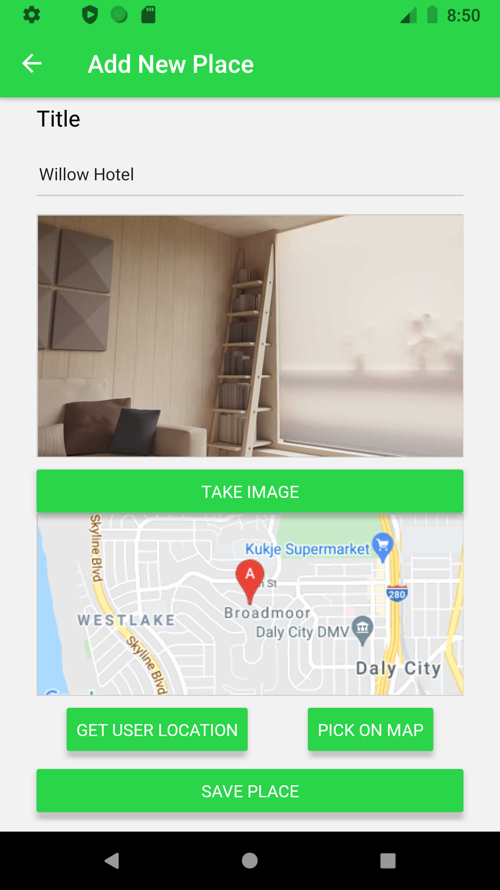

NiceView is an app that allows people to share point of interests with others. From beautiful scenery to location with a “Nice View”, you can mark the location and share it with everyone. NiceView is a mobile app for iOS/Android developed with React Native/JavaScript.

All the locations and images in posts are store in the internal storage of the device using SQLite.

#

To run the project:

1. Install expo
2. Clone this repo
3. Run `npm install`
4. Run `npm start`

<h3>Home Screen:</h3>

All the local point of interests are shown in the home screen.

<h3>Detail Screen:</h3>

Each post will show the picture and the location of the photo. Tapping on the location will display it on the map allowing you to see where it is and get direction there.

<h3>Add New Location Screen:</h3>

The user will take a picture and get the current location or pick the location on the map.

(Android Version vs iOS Version)

<h3>Demo Video:</h3>
https://youtu.be/O82wXkZ1Bnc
